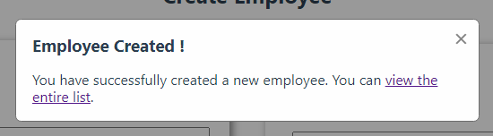

# @alex-pqn/react-modal

[](LICENSE.md)
[](https://www.npmjs.com/package/@alex-pqn/react-modal)
[](./package.json)

## Install

```bash
npm i @alex-pqn/react-modal
```

## Example



## Usage

```jsx
import React, { useState } from 'react';

import { Modal } from '@alex-pqn/react-modal';

const App = () => {
  const [isModalShown, setIsModalShown] = useState(false);

  const openModal = () => setIsModalShown(true);
  const closeModal = () => setIsModalShown(false);

  return (
    <main>
      <button onClick={openModal}>Open modal</button>

      <Modal
        isShown={isModalShown}
        trigger={setIsModalShown}
        width={27}
        title="Your modal title"
        message="Your modal message"
      />
    </main>
  );
};

export default App;
```

## Props

| Name    | Description                         | Type               | Is Required | Default            |
| ------- | ----------------------------------- | ------------------ | ----------- | ------------------ |
| isShown | Is modal shown ?                    | **_boolean_**      | Yes         | n/a                |
| trigger | A trigger for turning off the modal | **_func_**         | Yes         | n/a                |
| width   | The modal width                     | **_number_** 1-100 | No          | 27                 |
| title   | Your modal title                    | **_string_**       | No          | Your modal title   |
| message | Your modal message (can be DOM)     | n/a                | No          | Your modal message |
